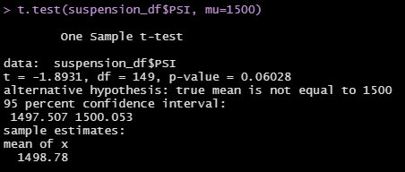

# MechaCar Statistical Analysis

## Linear Regression to Predict MPG

* Which variables/coefficients provided a non-random amount of variance to the mpg values in the dataset?
    * With the data gathered from the summary, the __*weight, spoiler angle, and drivetrain*__ all gave non-random variance in how it affected the MPG. Length is <Intercept>. With the __*length and ground clearance*__ providing random variance in the car's MPG. This follows the knowledge I have regarding motor vehicles. Spoiler angle provides more air resistance and affecting the coefficient of drag which will make the engine push harder to overcome it. More weight is similar, in that the more weight an engine needs to propel forward, it needs more effort. Powering more than 2 wheels also affects MPG, as the most efficient internal combustion engine vehicles are typically 2WD. Longer cars may have either high or low MPG, as other factors are what determine it. Same goes with ground clearance, though it may also affect the coefficient of drag.
* Is the slope of the linear model considered to be zero? Why or why not?
    * The p-value is smaller than .05 for this model, so it cannot be assumed to be a 0 slope.
* Does this linear model predict mpg of MechaCar prototypes effectively? Why or why not?
    * With the different attributes of any possible *internal combustion engine* vehicle having possible affects to the MPG, it is safe to assume that whatever car MechaCar makes, the attributes assigned to it would give a more accurate representation on how the MPG will be affected.

## Summary Statistics on Suspension Coils

* The design specifications for the MechaCar suspension coils dictate that the variance of the suspension coils must not exceed 100 pounds per square inch. Does the current manufacturing data meet this design specification for all manufacturing lots in total and each lot individually? Why or why not?
    * For the manufacturing lots of __*1 and 2*__ specifically, they match the specifications for having less than 100PSI variance by a landslide. The only lot not to do so is lot __*3*__. The largest variance by far of *170PSI* is significantly over the ideal range. With this data, *vehicles using suspension coils from lot 3 are more likely to not meet the performance standards set*.

## T-Tests on Suspension Coils

* For Lot 1 the p-value is over .05, coming in at 1, and as such we can accept it as being within typical parameters of production.
* For Lot 2 the p-value is still over .05, at .6, following Lot 1 as being typical.
* For Lot 3 the p-value is under .05, at .04, thus signifying a significant departure from the normal parameters.

## Study Design: MechaCar vs Competition
* What metric or metrics are you going to test?
    * With the current car market slowly, but surely changing from an *internal combustion engine* one to a *fully electric* one, MechaCar needs to look at the development of an affordable fully electric vehicle to stay with the burgeoning market that will overtake the old. This will affect the costs of purchasing but also costs of owning, versus the old comparable engine powered vehicles.
* What is the null hypothesis or alternative hypothesis?
    * Null hypothesis: There is no difference in overall cost of ownership between an internal combustion engine vehicle versus a fully electric vehicle. As such there will not be a change in sales between the two in a similar market.
    * Alternative hypothesis: There is a significant difference in overall cost of ownership between an internal combustion engine vehicle versus a fully electric vehicle. As such there will certainly be a change in sales between the two in a similar market.
* What statistical test would you use to test the hypothesis? And why?
    * Multiple linear regression would be a good fit for statistical analysis as it offers data for a combination of independent variables, as ICE and electric vehicles have a large amount of differences in variables.
* What data is needed to run the statistical test?
    * Cost per mile for ownership, initial costs, maintenance costs over a similar mile range (ex. 100,000 miles).
