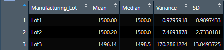

# MechaCar Statistical Analysis

## Linear Regression to Predict MPG
* Which variables/coefficients provided a non-random amount of variance to the mpg values in the dataset?
    * 
* Is the slope of the linear model considered to be zero? Why or why not?
    * 
* Does this linear model predict mpg of MechaCar prototypes effectively? Why or why not?
    * 

## Summary Statistics on Suspension Coils
* The design specifications for the MechaCar suspension coils dictate that the variance of the suspension coils must not exceed 100 pounds per square inch. Does the current manufacturing data meet this design specification for all manufacturing lots in total and each lot individually? Why or why not?
    * 

## T-Tests on Suspension Coils
* then briefly summarize your interpretation and findings for the t-test results. Include screenshots of the t-test to support your summary.

## Study Design: MechaCar vs Competition
* What metric or metrics are you going to test?
    * 
* What is the null hypothesis or alternative hypothesis?
    * 
* What statistical test would you use to test the hypothesis? And why?
    * 
* What data is needed to run the statistical test?
    * 
